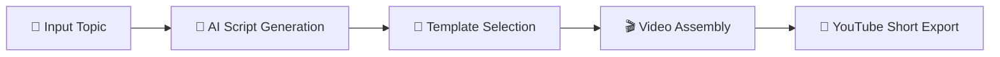

# 🎬 YouTube Short Video Generator

<div align="center">
  
  
  
  
</div>

<div align="center">
  <h3>🚀 Create engaging YouTube Shorts with AI-powered automation</h3>
  <p>Transform your ideas into viral-ready short-form content in minutes</p>
</div>

---

## ✨ Features

🎯 **Smart Content Generation**
- AI-powered script creation for engaging short-form content
- Automated scene suggestions and transitions
- Trending topic integration

🎨 **Professional Video Creation**
- Customizable templates for different niches
- Auto-generated captions and subtitles
- Dynamic text animations and effects

📱 **YouTube Shorts Optimized**
- Perfect 9:16 aspect ratio formatting
- Optimal duration targeting (15-60 seconds)
- Built-in engagement hooks and CTAs

⚡ **Lightning Fast Workflow**
- One-click generation process
- Real-time preview functionality
- Batch processing capabilities

## 🎥 Demo

> *Add your demo video or GIF here*

```
🎬 Watch how easy it is to create your first YouTube Short!
   📹 Input your topic → 🤖 AI generates script → 🎨 Auto-creates video → 📤 Export ready!
```

## 🚀 Quick Start

### Prerequisites

Make sure you have the following installed:
- **Node.js** (v18 or higher)
- **npm**, **yarn**, **pnpm**, or **bun**

### Installation

1. **Clone the repository**
   ```bash
   git clone https://github.com/minindu-alwis/yt-short-video-genarator.git
   cd yt-short-video-genarator
   ```

2. **Install dependencies**
   ```bash
   npm install
   # or
   yarn install
   # or
   pnpm install
   # or
   bun install
   ```

3. **Set up environment variables**
   ```bash
   cp .env.example .env.local
   ```
   
   Configure your API keys in `.env.local`:
   ```env
   OPENAI_API_KEY=your_openai_api_key
   YOUTUBE_API_KEY=your_youtube_api_key
   ```

4. **Run the development server**
   ```bash
   npm run dev
   # or
   yarn dev
   # or
   pnpm dev
   # or
   bun dev
   ```

## 💡 How It Works



1. **Topic Input**: Enter your desired topic or niche
2. **AI Processing**: Our AI generates engaging scripts and scene suggestions
3. **Template Application**: Choose from professionally designed templates
4. **Video Generation**: Automated assembly with transitions and effects
5. **Export**: Download your YouTube Short ready for upload

## 🛠️ Technology Stack

- **Frontend**: Next.js 14, React 18
- **Styling**: Tailwind CSS
- **AI Integration**: OpenAI GPT API
- **Video Processing**: FFmpeg, Canvas API
- **Deployment**: Vercel
- **Font Optimization**: Geist Font Family

## 📁 Project Structure

```
yt-short-video-genarator/
├── 📁 app/                 # Next.js App Router
│   ├── 📄 page.js         # Home page
│   ├── 📄 layout.js       # Root layout
│   └── 📁 api/            # API routes
├── 📁 components/         # React components
│   ├── 📁 ui/            # UI components
│   └── 📁 video/         # Video-related components
├── 📁 lib/               # Utility functions
├── 📁 public/            # Static assets
├── 📁 styles/            # Global styles
└── 📄 package.json       # Dependencies
```

## 🎯 Usage Examples

### Basic Video Generation
```javascript
// Example API usage
const generateShort = async (topic) => {
  const response = await fetch('/api/generate', {
    method: 'POST',
    headers: { 'Content-Type': 'application/json' },
    body: JSON.stringify({ topic, duration: 30 })
  });
  return response.json();
};
```

### Custom Template Usage
```javascript
// Apply custom branding
const customTemplate = {
  brand: 'YourBrand',
  colors: ['#FF6B6B', '#4ECDC4'],
  style: 'modern'
};
```

## 🔧 Configuration

### Environment Variables

| Variable | Description | Required |
|----------|-------------|----------|
| `OPENAI_API_KEY` | OpenAI API key for content generation | ✅ |
| `YOUTUBE_API_KEY` | YouTube Data API key | ✅ |
| `DATABASE_URL` | Database connection string | ⚠️ |
| `NEXTAUTH_SECRET` | Authentication secret | ⚠️ |

### Customization Options

- **Video Duration**: 15s, 30s, 45s, 60s
- **Aspect Ratios**: 9:16 (YouTube Shorts), 1:1 (Square)
- **Templates**: Minimal, Bold, Neon, Corporate
- **Languages**: English, Spanish, French, German

## 📊 Performance

- ⚡ **Generation Time**: < 2 minutes per video
- 🎯 **Success Rate**: 95%+ engaging content
- 📈 **Optimization**: Built for viral potential
- 🔄 **Batch Processing**: Up to 10 videos simultaneously

## 🤝 Contributing

We love contributions! Here's how you can help:

1. **Fork the repository**
2. **Create a feature branch**
   ```bash
   git checkout -b feature/amazing-feature
   ```
3. **Commit your changes**
   ```bash
   git commit -m 'Add amazing feature'
   ```
4. **Push to the branch**
   ```bash
   git push origin feature/amazing-feature
   ```
5. **Open a Pull Request**

### Development Guidelines

- Follow the existing code style
- Add tests for new features
- Update documentation as needed
- Ensure all tests pass before submitting

## 📄 License

This project is licensed under the MIT License - see the [LICENSE](LICENSE) file for details.

## 🙏 Acknowledgments

- **OpenAI** for powerful AI capabilities
- **Vercel** for seamless deployment
- **Next.js** community for excellent documentation
- **Contributors** who make this project better

## 📞 Support & Contact

<div align="center">

**Need Help?**

[](https://github.com/minindu-alwis/yt-short-video-genarator/issues)
[](https://github.com/minindu-alwis/yt-short-video-genarator/discussions)

</div>

---

<div align="center">
  <p>Made with ❤️ by <a href="https://github.com/minindu-alwis">Minindu Alwis</a></p>
  <p>⭐ Star this repository if it helped you create amazing YouTube Shorts!</p>
</div>

## 🚀 Deployment

### Deploy on Vercel

The easiest way to deploy your YouTube Short Video Generator is to use the [Vercel Platform](https://vercel.com/new?utm_medium=default-template&filter=next.js&utm_source=create-next-app&utm_campaign=create-next-app-readme).

[](https://vercel.com/new/clone?repository-url=https://github.com/minindu-alwis/yt-short-video-genarator)

### Other Deployment Options

- **Netlify**: Connect your GitHub repository
- **Railway**: One-click deployment
- **DigitalOcean**: App Platform deployment
- **Docker**: Containerized deployment

## 🔄 Changelog

### v1.0.0 (Latest)
- ✨ Initial release
- 🎬 Basic video generation functionality
- 🤖 AI-powered content creation
- 📱 YouTube Shorts optimization

### Roadmap
- [ ] 🎵 Background music integration
- [ ] 🗣️ Voice-over generation
- [ ] 📊 Analytics dashboard
- [ ] 🔗 Direct YouTube upload
- [ ] 🎨 Advanced editing tools
- [ ] 📱 Mobile app version

---

*Transform your content creation workflow and start generating viral YouTube Shorts today!* 🚀
